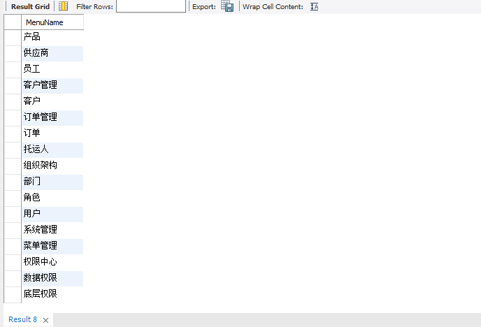
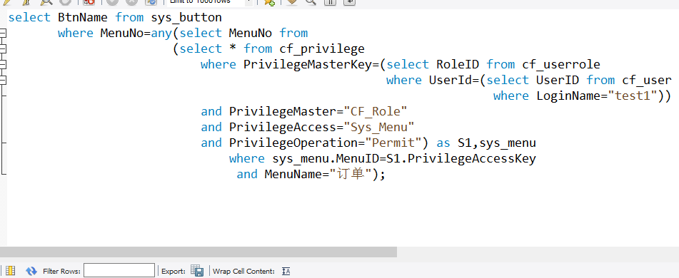
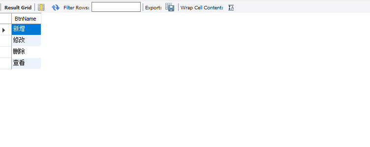

###用户test1可以查看的页面（Sys_menu）

###结果

###伪代码:
1、根据名称查找人员编号UserID

2、根据人员编号UserID查找改人员所对应的角色集合RoleIDs
###订单(order)页面中的操作权限(sys_button）

###结果

###伪代码:
1、根据名称查找人员编号UserID
2、根据人员编号UserID查找改人员所对应的角色集合RoleIDs

